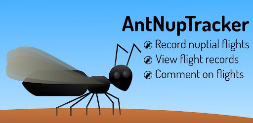

# antnuptracker-server
Server backend for AntNupTracker. 



Copyright (C) Abouheif Lab, 2020-2022

Visit us at https://www.antnuptialflights.com to learn more about our project. For the client app, see [this repository](https://github.com/bzrudski/ant_nup_tracker_client). This application is a Django-based web app for recording, storing and accessing ant nuptial flight information. The web framework is written using Django, with a REST API added using Django REST Framework (to be documented...). Knox is used for authentication. This app should work on most major operating systems and should be compatible with the major database engines used by Django.

## Notes on Licensing
* This server-side application is licensed under the GNU AGPLv3 (see `COPYING`). However, there are a few trademarked images that cannot be licensed in this form. These include social networking and app-distribution related image files. These files can be placed in a folder located at `nuptialtracker/static/nuptiallog/images/proprietary`. Due to the licensing restrictions, this folder is excluded from the repository in the `.gitignore` file. Future proprietary required images should be included in this directory, excluded from git remotes, and clearly documented with a comment and/or an alt text.

* All files from Django Rest Framework are Copyright © 2011-present, Encode OSS Ltd.

* The list of genera and species presented in the app (last updated summer of 2019) is found at `nuptialtracker/nuptiallog/taxonomyRaw` and was copied from [Category:Extant species](https://antwiki.org/wiki/Category:Extant_species) on _AntWiki_. In keeping with the original licensing, this list is licensed under the [Creative Commons Attribution-ShareAlike 4.0 International License](http://creativecommons.org/licenses/by-sa/4.0/).

* Weather information from [OpenWeatherMap](https://openweathermap.org/), which is made available here under the [Open Database License (ODbL)](https://opendatacommons.org/licenses/odbl/1-0/).

* The website is typeset in [Dosis](https://fonts.google.com/specimen/Dosis) by Impallari Type and [Open Sans](https://fonts.google.com/specimen/Open+Sans) by Steve Matteson.

* The `Terms and Conditions` and `Privacy Policy` were obtained from [TermsFeed](termsfeed.com/). The necessary templates have been omitted from the repository. If you are forking this repository, please provide a `Terms and Conditions` and a `Privacy Policy`.

## Note on Contributions
* Do **not** push your configuration-specific changes to `settings.py` to this repo. This file is required for **you** to be able to run your modified web app on a development system. The production version uses its own `settings.py`.
* Do **not** push your changes to any environmental variable names unless they are necessary. Do **not** push your `.env` file to this repository.
* Do **not** add proprietary social media icons. Instead, put an `img` tag (if in `HTML`) with descriptive alternate text.
* Always go through a pull request. Don't commit to the `main` branch.

## Documentation and Naming conventions
At the moment, very little of the code is documented. This will change soon.

In terms of naming conventions, there is a mix of `snake_case` and `camelCase` used in the code. This is due to the Django/**Python**® prevalence of `snake_case` coming into conflict with the prevalence of `camelCase` in other programming languages, such as Swift® and Dart™. At this point, the **Python** code for the server is mostly in `snake_case`, while JSON keys required for communication with clients are in `camelCase`.

The official name of this app is **AntNupTracker**. However, it was originally **NuptialLog** and then **NuptialTracker**. These names remain throughout the file hierarchy. Eventually, we may switch all references to **AntNupTracker**. If you want, feel free to put this in a pull request. Just make sure to fix **all** the imports.

## Note on `static` and `media`
* `media` is for user-uploaded flight images
* `static` contains the static files for the project. It is the `STATIC_ROOT` and `STATIC_URL`

## Note on Notifications
This app originally relied on purely APNs notifications. However, we have switched to using Firebase to support both iOS and Android™. In order to take advantage of notifications, you must use Firebase. The code is included in this repository, but you must generate your own credentials.

## Note on Weather
All weather data stored on the server is obtained from [OpenWeatherMap](https://openweathermap.org/). This data is made available here under the [Open Database License (ODbL)](https://opendatacommons.org/licenses/odbl/1-0/). In order to be able to fetch and parse weather data, you must obtain an API Key from OpenWeatherMap (free option available). Otherwise, simply comment out the lines in `nuptialtracker/nuptiallog/views.py` that create a new thread to fetch the weather.

## Instructions for setting up a test server
In order to set up a test server, the following must be performed:

1. Clone this repository
    ```bash
    git clone https://github.com/bzrudski/antnuptracker-server.git
    ```
2. Set up the web server with the `WSGI` configuration
3. **(Optional)** Create a Firebase project for the app and a Firebase service account.
4. Set up a `virtualenv` in the root directory of the repository: 
    ```bash
    $ virtualenv env
    $ source env/bin/activate
    $ pip install -r requirements.txt
    ```
5. Set up the following environment variables (use a `.env` file)
   ```bash
    export SECRET_KEY=''
    export DB_PASS=''
    export DB_USER=''
    export EMAIL_PASS=''
    export EMAIL_ADDR=''
    export WEATHERKEY=''
    export TAXONOMY_FILE=''
    export GOOGLE_APPLICATION_CREDENTIALS=''
   ```
    **Note:** Some of these variables are _optional_:
    * `WEATHERKEY` (obtained from `OpenWeather`) is required to fetch the weather information.
    * `GOOGLE_APPLICATION_CREDENTIALS` provides the path to the service account JSON file for Firebase.

   Make sure to edit the web server settings to pass these environment variables to the web server. In Apache, add the above declarations to `/etc/apache2/envvars`. If you need to rename any of the environmental variables, make sure to change them in relevant source files. MAKE SURE NOT TO COMMIT THESE CHANGES.
6. Edit `nuptialtracker/nuptialtracker/settings.py` to add your database and email settings. If your server does not have an `SSL` certificate, edit the security settings to prevent `HTTPS` redirect and to allow for insecure `CSRF` tokens. Also, change the settings to allow insecure cookies. This is required to use the admin interface. **You must configure your database before moving on to the next steps.**
7.  Perform the database migrations
    ```bash
    $ python manage.py migrate
    ```

9. Restart the web server
10. In order to report flights, the taxonomy database must be built. In order to do this, enter the Django shell. Make sure to run your `.env` file first to load the `SECRET_KEY`.
    ```bash
    $ source .env
    $ python manage.py shell
    ```
    A **Python** shell will launch. Use this shell to build the database:
    ```python
    > from nuptiallog import taxonomy
    > taxonomy.create_Genus_Objects(taxonomy.GENERA)
    > taxonomy.create_Species_Objects(taxonomy.SPECIES)
    ```

Now, your development server will be able to work. Remember that if you want to test the mobile app with your modified server app, you must change the `base` in the `url_manager.dart` file of the app's source code (see [this repository](https://github.com/bzrudski/ant_nup_tracker_client)).

IOS is a trademark or registered trademark of Cisco in the U.S. and other countries. Swift, Apple and App Store are trademarks of Apple Inc., registered in the U.S. and other countries.

Dart and the related logo are trademarks of Google LLC. We are not endorsed by or affiliated with Google LLC.

Firebase and Google are trademarks of Google LLC.

Android is a trademark of Google LLC.

Python is a registered trademark of the Python Software Foundation.

Django is a trademark of the Django Software Foundation.
